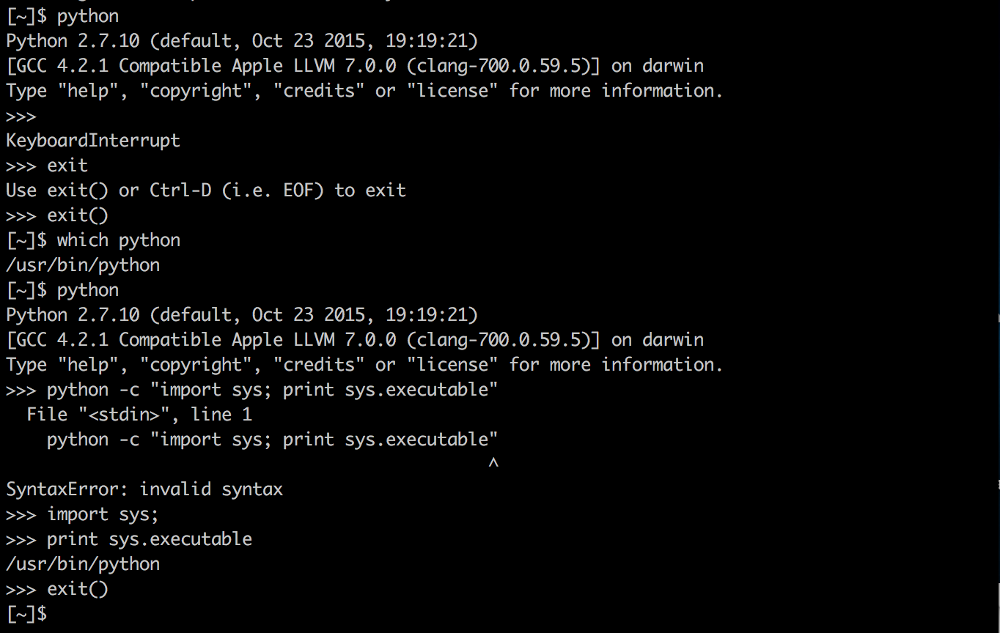
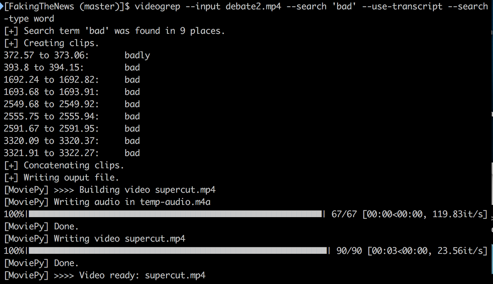

# First fake video

[Notes on the class can be found here](https://github.com/nicolaspe/itp_fakingthenews/blob/master/class01/01_class.md)

## On class
I had several problems on class while trying to make `youtube-dl` and `videogrep` work.

Had to change ownership of several folders, as I did not have permission to write on them (how this happened is a mystery for now). Between the `brew doctor` and it's [Troubleshooting file](https://docs.brew.sh/Troubleshooting.html), I found the answer: `sudo chown -R $(whoami)`. That solved the "brew link" issue.

Still, that was not enough. I kept getting errors I did not know how to handle. When trying to change ownership of the Python folder, I ran into the fact that the specified location `Library/Python` did not exist. So I run Python to find out (learning how to quit Python from the terminal (`exit()`) in the process), and changing ownership of that folder. It may have helped, but I was still running into issues.

I decided to look at the ffmpeg portion of the problem and adopt some more extreme measures. I uninstalled and reinstalled ffmpeg and videogrep, restarted the computer... *et voilá*! One of the many things I did worked and I got my video. (Maybe all of them were needed, maybe it was the magic computer gnomes, I really don't know for sure.)

**Conclusions** (and other findings):
- `youtube-dl` needs `-f` options (at least for me)
- `videogrep` does NOT work with .3gp and .webm files

## Assignment and experimentation

#### *franken* video

I have a love/hate relationship with Taylor Swift('s music). I can't help loving it, but as a feminist, it betrays my very own principles. So I decided to use one of her award acceptance speeches to unveil part of what she really does (with a dose of humor) (at least for me it is hahaha). I chose her speech for the [58th Album of the Year Grammy Award](https://youtu.be/dMCAEUb0h34).

**Cutting the video**:
I wanted to use only a portion of the video, to make sure that only Taylor Swift would speak, but youtube-dl does not have that option (at least for now). I tried to work around that, feeding it the youtube URL that starts the video at a certain point (adding `?t=52s` at the end of the URL), but that did not work either.

>I take credit of the work of other women and undercut their fame and it is the greatest feeling in the world Thank you for the fame for the success for the honor of other women I sidetrack

`videogrep --input taylorswift_speech.mp4 --search "I take credit of the work of other women and undercut their fame and it is the greatest feeling in the world. Thank you for the fame, for the success, for the honor of other women I sidetrack" --search-type franken --use-transcript`

It got stuck. Is it too much? Let's try to avoid the pitfall (commas?). Nope, seemingly got stuck in the same part. Maybe it's too long. Will try with less. Nope, again... 😩

I'm trying to use the original option, just to create a supercut, but it is getting stuck on the same place. It finds the words, but it does not concatenate the clips.

#### Potential class project
Our creative process for the next few weeks will loosely follow **Baudrillard’s “procession of the simulacra”** (we’ll discuss in more detail next time).

To get started, please sketch a couple paragraphs on **the basic reality you want your project to reflect**. In other words, what are you interested in responding to with your fake news item—perhaps a social issue? A cultural issue? Some problem with the way we are communicating today? To take some examples from the last class:

Look into:
- [The Yes Men’s BBC hoax](https://www.theguardian.com/media/2004/dec/04/india.broadcasting) reflected the injustice and the basic assumption that Union Carbide would escape accountability for the chemical spill in Bhopal.
- [The Onion’s Abortionplex spoof](http://www.theonion.com/article/planned-parenthood-opens-8-billion-abortionplex-20476) reflected the readiness of some conservatives to believe that Planned Parenthood is about abortion-on-demand.

#### Readings and thoughts

####
