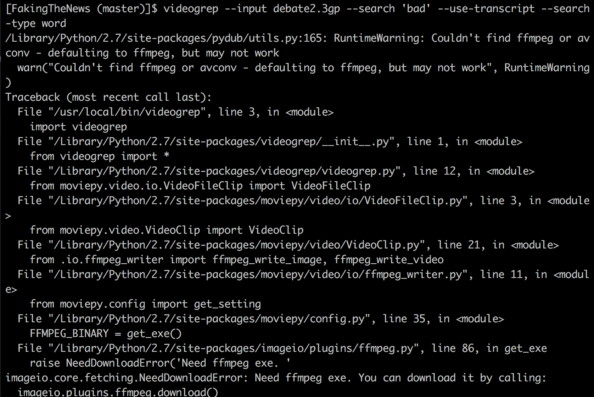
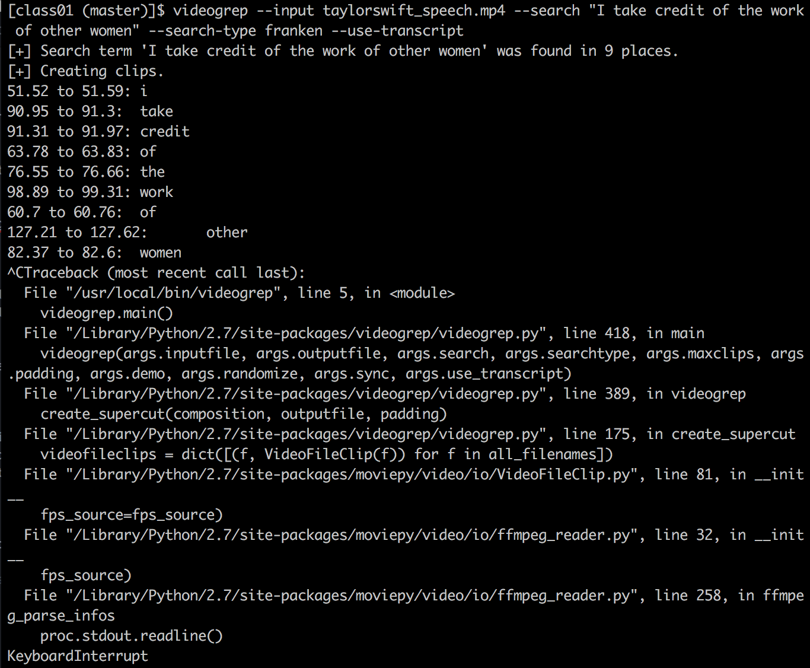

# First fake video

[Notes on the class can be found here](https://github.com/nicolaspe/itp_fakingthenews/blob/master/class01/01_class.md)

## On class
I had several problems on class while trying to make `youtube-dl` and `videogrep` work.

Had to change ownership of several folders, as I did not have permission to write on them (how this happened is a mystery for now). Between the `brew doctor` and it's [Troubleshooting file](https://docs.brew.sh/Troubleshooting.html), I found the answer: `sudo chown -R $(whoami)`. That solved the "brew link" issue.



Still, that was not enough. I kept getting errors I did not know how to handle. When trying to change ownership of the Python folder, I ran into the fact that the specified location `Library/Python` did not exist. So I run Python to find out (learning how to quit Python from the terminal (`exit()`) in the process), and changing ownership of that folder. It may have helped, but I was still running into issues.


I decided to look at the ffmpeg portion of the problem and adopt some more extreme measures. I uninstalled and reinstalled ffmpeg and videogrep, restarted the computer... *et voilá*! One of the many things I did worked and I got my video. (Maybe all of them were needed, maybe it was the magic computer gnomes, I really don't know for sure.)


**Conclusions** (and other findings):
- `youtube-dl` needs `-f` options (at least for me)
- `videogrep` does NOT work with .3gp and .webm files


## Assignment and experimentation

#### *franken* video

I have a love/hate relationship with Taylor Swift('s music). I can't help loving it, but as a feminist, it betrays my very own principles. So I decided to use one of her award acceptance speeches to unveil part of what she really does and her utilitarian view of feminism (with a dose of humor) (at least for me it is hahaha). For this, her speech for the [58th Album of the Year Grammy Award](https://youtu.be/dMCAEUb0h34) was ideal.

I wanted to use only a portion of the video, to make sure that only Taylor Swift would speak, but youtube-dl does not have that option (at least for now). I tried to work around that, feeding it the youtube URL that starts the video at a certain point (adding `?t=52s` at the end of the URL), but that did not work either.

The first couple of tries were not successful at all. videogrep would get stuck after "Creating clips", before the "Concatenating clips" would start. I tried erasing the commas, a shorter text, returning to normal supercuts, trying yet again with the debate video we used in class, but nothing would get it past that part. Thankfully, the core principle of computing worked and after restarting everything went great. Well... almost.



The transcript picked some weird noises from the beginning as words, so I really need to cut the video (just used iMovie for this). Also, the automatic transcript is not really that good, so I had to and adjust the words so it could be somewhat understood. I also tried with a Casey Affleck speech, addressing the fact that he can be nominated and win an Oscar despite the sexual harassment accusations against him. But his pronunciation and the transcription results were way worse. You need someone who speaks really clearly in order to use the automatic transcript accurately. After an analysis of Taylor's speech, I finally crafted the following message for her to say:
>I take credit of the work of women, of your accomplishments and fame, and that is the greatest feeling in the world

```
videogrep --input taylorspeech.mp4 --transcribe

videogrep --input taylorspeech.mp4 --search 'I take credit of the work of women of your accomplishments and fame and that is the greatest feeling in the world' --search-type franken --use-transcript --padding 15
```

<iframe src="https://player.vimeo.com/video/233037791" width="640" height="360" frameborder="0" webkitallowfullscreen mozallowfullscreen allowfullscreen></iframe>


#### Potential class project - Left wing contradictions to revive engagement and closeness

For the final project of this course, there's a specific question to address: what basic reality do I want my project to reflect? Most of my work focuses on instigating a reflection on privilege, stereotypes and hegemonic masculinity. But now there is a more pressing matter I would like to cover.

Presidential elections are coming up in Chile. The right-wing candidate, former president and garbage person, Sebastián Piñera is currently leading the polls. A person with no ethics whatsoever, someone who's only interested on expanding his own fortune and to govern for the 1%.

But people already know this. He's been publicly called out on several occasions but he diverts attention claiming they're all personal attacks and that everything he does is legal (even if it is not). He also blatantly lies about facts and policies, i.e: one of his leading projects address a non-existant crime rise on the country (even when it was worse under his own previous administration). The fact that so many people defend him so fervently, makes me think it is a futile dispute.

Instead, I want to focus the reflection on the other side, specifically on the *"Frente Amplio"* political coalition. Aside from posing a new alternative to the existing bipartisan system, they are a fresh anti-establishment face which has acted on principle on the few House spots they've managed to win. That said, a major problem of left parties nowadays (in Chile and even worldwide) is a lack of summoning power. Chilean comedian [Beno Espinosa states in an interview](http://www.eldesconcierto.cl/2017/05/09/beno-espinosa-comediante-la-izquierda-no-sabe-reirse-de-sus-propias-contradicciones-por-eso-no-convoca/) that the left has failed to laugh about themselves. They don't address their own contradictions and that alienates people.

Thus, I want to reflect on the incongruities of the left-wing candidate, to show the ability to use that as a means to perfect themselves, and that even if they have these problems that cannot be overlooked, they're nowhere near the deep ethical conflicts the right wing has shown historically.
