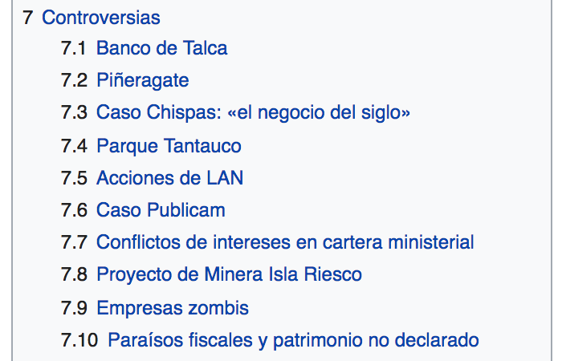
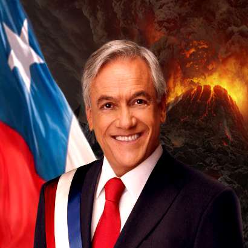
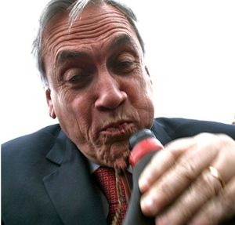

# The worst Chilean supervillain: posting my fake plan online

### (de)Motivation and Ideas
Chile is about to have a new president. The elections will be held on November and Sebastián Piñera, Alejandro Guillier and Beatriz Sánchez are the main protagonists (at least for now). The corruption, misogyny and unethical practices of the former president of Chile does not seem to have any effect at all, as the polls show him with a great advantage. They are widely spread, his [Wikipedia site](https://es.wikipedia.org/wiki/Sebasti%C3%A1n_Pi%C3%B1era) has a whole section dedicated to this point, and his several impasses always get to the media. Moreover, his decisions and the people he surrounds himself with, show clear intentions of having an extremely conservative and privilege-oriented government.

The core of this project is to instigate a reflection on a basic reality. As the reality about this candidate is already there, and it does not seem to matter, I need to change the focus. Addressing the businesspeople threatening to leave the country and the voters that don't seem to mind about his behaviour are a much better target. As Piñera's present and past actions give us a pretty accurate prediction of what might happen, I'll use these real facts to create an alternative reality.

My project will showcase a reality in which Sebastián Piñera openly and shamelessly benefits his voters and close businesspeople through various illegal means: privileges, express laws, tax cuts, etc. Part of the reasoning here is that people already knew who were they voting for, because of his history and who stands next to him; so there's no need to hide it after he becomes president. This can take the form of a documentary set in the future, a conspiracy theory or an absurd satirical fake news article.

Whatever the form, the project will follow the next structure:
1. Via Twitter bots I'll spread the idea of anticipating a highly corrupt Piñera government. I'll base such comments on the people he's chosen for his citizen council and the representatives he's been supporting.
2. Next, I'll edit some videos to reaffirm his ties to corruption, to give more strength to this corrupt government idea.
3. Close to the release of the article or documentary, I'll edit some news media sites to create fake headlines writing about these favours as if they were something good, but with a clear corruption undertone (because the biggest media outlets in Chile are controlled by right-wing supporters).
4. Finally, I'll release the fake documentary or article gathering all these pieces and some more evidence to craft this final piece and generate the reflection I want to make. This is the punchline.

This would help creating an environment for the final product to come to light. An idea will already be present and by mixing those ideas with theories derived from actual facts, will help the spread of this material.

Source: [The Clinic](http://www.theclinic.cl/2010/03/12/minutas-de-traspaso-de-mando/)

### Underlying lies

I want to make use of two core principles of fake news:
- Negative ideas travel faster than positive ideas
- The perversion of reality creates an absence which will be masked and looked for by the public themselves

I want the news to be fake, but as the reactions will be real, I want to implant the conspiracy first, to analyze those reactions after it all comes to the light. I want to show that people don't mind corruption if it comes from their side and will work to their advantage. Even if it means lowering the quality of life of other people.

### Research: laws in Chile
After a short research, I found that there are not many laws that cover these topics in Chile. The parody law only applies for Intellectual Property matters. A far-right political party, recently tried to [judge social media site administrators](http://www.tarreo.com/noticias/358378/Chile-Ley-busca-culpar-a-administradores-de-redes-sociales-por-cuentas-parodia) [that host parody accounts](http://www.cnnchile.com/noticia/2016/02/04/udi-presento-proyecto-contra-cuentas-de-parodia-en-redes-sociales). Yeah, they want to sue Zuckerberg for Facebook parody sites. Even if most of those accounts state that they are a parody in their profiles. Of course, that didn't come through. But I still don't know if there could be any actual legal repercussion. I'll make more advances of this matter this week.

### More readings about Piñera
- [El Mostrador, Por qué Piñera habla como telepredicador](http://www.elmostrador.cl/noticias/pais/2011/03/07/por-que-pinera-habla-como-telepredicador/)
- [The Economist, Progress and its discontents](http://www.economist.com/node/21552566)
