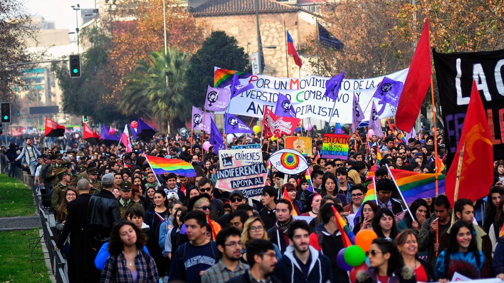

# Hoax and project brainstorming

Satire about far-right chilean politics thinking that there is a "gay dictatorship" trying to overcome the religious thoughts.

Frame it as a "holy war" of the Church against a new world order.

Frame this article as a hacktivism attack on a major news site.

## Research

#### Ideología de género
> Pero antes de empezar, será bueno recordar unas afirmaciones del cardenal Ratzinger, actual Benedicto XVI, y algunos conceptos esenciales:
>
>Escribía Ratzinger:
>
>La ideología de género es la última rebelión de la creatura contra su condición de creatura.
>
>Con el ateísmo, el hombre moderno pretendió negar la existencia de una instancia exterior que le dice algo sobre la verdad de sí mismo, sobre lo bueno y sobre lo malo.
>
>Con el materialismo, el hombre moderno intentó negar sus propias exigencias y su propia libertad, que nacen de su condición espiritual.
>
>Ahora, con la ideología de género el **hombre moderno pretende librarse incluso de las exigencias de su propio cuerpo: se considera un ser autónomo que se construye a sí mismo;** una pura voluntad que se autocrea y se convierte en un dios para sí mismo.

[Source](http://es.catholic.net/op/articulos/41418/cat/447/que-es-la-ideologia-de-genero.html)

La última moda del hombre y mujer modernos (la ideología de género incluye la aberración de la mujer de querer separarse del hombre) en la cual se sienten con la libertad de seres autónomos,

Artículos con clara homofobia o misoginia en ellos. Lo cual será revelado al final

#### Henry Boys

> — ¿Entonces no compartes que existan estos problemas de género?
>
> — El género es el material con el que se hace la ropa. El resto es ideología.

[Source](http://impresa.lasegunda.com/2016/11/18/A/7531UVCG/all)

#### Movimiento Social Patriota

Revelarlos como neo nazis, pero "en buena": "Aliados con los movimientos conservadores patriotas americanos"

[Source](http://www.eldesconcierto.cl/2017/05/29/no-a-la-dictadura-gay-movimiento-social-patriota-empapela-las-calles-con-consignas-homofobicas-y-xenofobas/)

#### Extras
- [Beno Espinosa, dictadura gay](http://www.eldesconcierto.cl/2017/08/29/video-el-viral-de-benito-espinosa-que-recrea-un-futuro-donde-la-dictadura-gay-se-instala-en-chile/)
- [Curb Your Enthusiasm review – if it ain't woke, don't fix it](https://www.theguardian.com/tv-and-radio/2017/oct/03/curb-your-enthusiasm-review-if-it-aint-woke-dont-fix-it)

## Photos Source
- http://static.t13.cl/images/sizes/1200x675/1466893829-auno684051.jpg
- http://vistelacalle.com/21720/hombres-con-falda/

## Article

**Dictadura gay penetra en el mercado con 'género anti-género'**

*Organizaciones pertenecientes al lobby gay logran crear prendas homosexualizadoras.*

La Dictadura Gay sigue avanzando en el mundo, esta vez a través de los mercados convencionales. Los científicos de esta secta han logrado crear un "género anti-género". Mediante peligrosos químicos ligados a estructuras del algodón y poliéster, introducen hormonas que favorecen las tendencias homosexuales en la población.

En una primera tirada, estas prendas fueron provistas exclusivamente al público LGBTQ con el fin de crear una fidelización más fuerte. Dentro de poco veremos por las calles los primeros prototipos, en forma de faldas de hombre y camisas para mujeres. Se presume además, que estas prendas serán capaces de liberar dichos compuestos al aire para pervertir a la población y generar aceptación de dichas perversiones. Sin embargo, fuentes exclusivas señalan que estos compuestos ya pueden ser encontrados en selectas prendas de la moda contemporánea. North Face, Uggs, Top Shop y Banana Republic se encontrarían dentro de las marcas afectadas.

Uno de los referentes del movimiento conservador de nuestro país intentó advertirnos de dichas maniobras hace poco más de un año. Sin embargo, es el mismo lobby detrás de la ideología de género el cual recurrió a tácticas de bloqueo sistemático. Es por esto que ha abandonado ese tema para intentar llegar a la población de otra forma.

¡La homosexualización de nuestra sociedad ha empezado! ¡No podemos perder la lucha por nuestra familia!

#### Translation
**Gay Dictatorship penetrates the market with 'anti-gender fabric'**

*Organizations linked to the Gay Lobby managed to create homosexualizing fabrics.*

The Gay Dictatorship keeps advancing in the world, this time by taking over conventional markets. Some scientists of this sect have managed to develop an anti-gender fabric. By attaching dangerous chemical products to cotton and polyester, they got to impregnate hormones linked to homosexuality.

The first batch was exclusively catered to LGBTQ groups, in order to create a stronger loyalty. Soon enough, we'll see the first prototypes on the street in the form of male skirts and female shirts. However, exclusive sources state that these products have already made their way into popular clothing pieces. Brands such as The North Face, Uggs, Top Shop and Banana Republic would be the first confirmed ones.

It is also presumed that this clothing will release airborne chemical compounds to pervert the population and generate acceptance of these deviations.

A referent in the Chilean conservative world, Henry Boys, tried to address this issue in August last year. However, the Gay Lobby blocked his attempts to intervene by systemic censorship. He is now trying to find different channels to address Chilean population and stop the advances of the Gay Dictatorship.

The homosexualization of our society has begun! We cannot lose the fight for our families!
